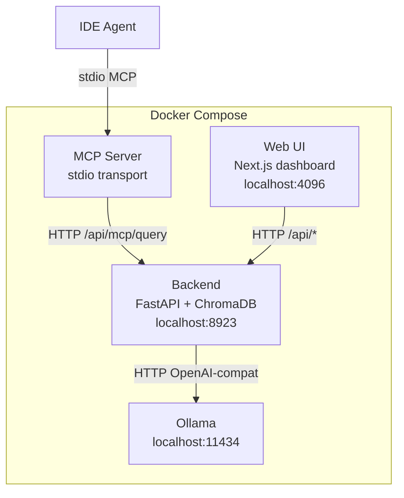

# PR-Distiller

> Extract reusable coding rules from your team's PR review history and serve them to AI coding assistants in real-time.

PR-Distiller crawls your GitHub repositories for merged pull request review comments, uses an LLM to classify and extract generalizable coding rules (security, architecture, performance, correctness, code-style, testing), deduplicates them semantically using ChromaDB vector similarity, and exposes them through a Model Context Protocol (MCP) server. IDE agents such as Cursor and Claude Code query the MCP server on every code change and receive project-specific constraints grounded in your team's actual review history.

## How It Works

```mermaid
flowchart LR
    GH[GitHub PRs]
    CR[Deep Crawler]
    SR[Security Redactor]
    LLM[LLM Extractor]
    SF[Semantic Fuser]
    DB[(ChromaDB)]
    MCP[MCP Server]
    IDE[IDE Agent\nCursor / Claude Code]

    GH -->|review comments| CR
    CR -->|raw comments| SR
    SR -->|PII-redacted text| LLM
    LLM -->|extracted rule JSON| SF
    SF -->|deduplicated rule| DB
    DB -->|vector query| MCP
    MCP -->|ranked constraints| IDE
```



1. **Deep Crawler** — fetches PR review comments from GitHub via the REST API, filtered by keyword heuristics and bot exclusion lists. Supports incremental crawling via per-repo cursor checkpoints.
2. **Security Redactor** — runs Microsoft Presidio PII detection and custom regex patterns (AWS keys, tokens) before any text reaches the LLM.
3. **LLM Extractor** — classifies each comment as `EXTRACT` or `SKIP`, then extracts structured JSON: title, description, enforcement prompt, category, confidence score, and file-path scoping patterns.
4. **Semantic Fuser** — queries ChromaDB for vector-similar existing rules (cosine distance threshold 0.32). Duplicate hits are merged by the LLM rather than stored as redundant entries. Occurrence counts accumulate on merged rules.
5. **ChromaDB** — persists rules with full metadata. Rules start in `needs_review` state; they are auto-promoted to `active` at confidence >= 0.80 or after human approval in the dashboard.
6. **MCP Server** — a TypeScript `@modelcontextprotocol/sdk` server exposing `query_architectural_constraints`. IDEs send the active code diff; the server returns the top-k semantically relevant rules ranked by occurrence density.

## Features

- Automated PR comment crawling with incremental cursor checkpoints (no re-processing)
- Two-stage LLM pipeline: fast classification pass, then structured extraction
- PII and secret redaction via Microsoft Presidio before any LLM call
- Semantic deduplication with ChromaDB cosine distance and LLM-assisted rule merging
- Rule review workflow: `needs_review` → `active` (auto or manual), `blocked`
- Per-rule effectiveness tracking: served, applied, dismissed, acceptance rate
- Auto-promotion of rules with >= 5 serves and > 70% acceptance rate
- File-path scoping: rules match only files whose paths satisfy configured glob patterns
- GitHub webhook integration: triggers incremental extraction on each merged PR
- Export to multiple formats: system prompt, Claude skill markdown, OpenAI function spec, AGENTS.md
- Multi-language AST support via tree-sitter (Python, TypeScript, JavaScript, Go, Rust)
- Next.js dashboard for rule browsing, manual approval, and pipeline configuration
- LLM-agnostic via LiteLLM: Ollama (default), vLLM, OpenAI, Anthropic, Google, OpenRouter

## Quick Start

Pick the path that matches your machine. Backend + Web UI always run in Docker; only the LLM placement differs.

### Common steps (all platforms)

```bash
git clone https://github.com/rendermani/PR-Distiller.git
cd PR-Distiller
cp .env.example .env           # set GITHUB_TOKEN at minimum
make preflight                 # detects OS + available accelerators
```

### macOS (Apple Silicon)

Docker on Mac cannot access the GPU, so the LLM runs on the host. Ollama on macOS uses Metal and unified memory automatically — full GPU acceleration, no config.

```bash
brew install ollama            # or download from https://ollama.com
ollama serve &                 # or launch the Ollama.app
make run-model                 # pulls qwen3:8b (~5.2GB)
make up                        # starts backend + web-ui in Docker
```

### Windows — host Ollama (WSL2 or native)

```powershell
# Install Ollama from https://ollama.com/download (native Windows installer)
ollama serve                   # runs in background automatically after install
make run-model
make up                        # points Docker at host Ollama
```

> Run `make` inside WSL2 or Git Bash. Docker Desktop must be running.

### Linux + NVIDIA GPU — everything in Docker

```bash
# Requires NVIDIA Container Toolkit: https://docs.nvidia.com/datacenter/cloud-native/container-toolkit/
make up-linux-gpu              # backend + web-ui + Ollama (GPU) all in Docker
make run-model
```

### Linux / any OS — CPU-only fallback

```bash
make up-cpu                    # backend + web-ui + Ollama (CPU) all in Docker
make run-model
```

### Finishing up

Open the dashboard at [http://localhost:4096](http://localhost:4096). Enter a repo in `owner/repo` format and click **Start** to trigger a crawl.

To stop everything: `make down`.

## Architecture



All services are containerized. The MCP server uses stdio transport and is started on demand (`docker compose run --rm mcp-server`) rather than as a persistent service.

## Configuration

All configuration is via environment variables. Copy `.env.example` to `.env` before first run. Runtime settings (deduplication threshold, auto-approve confidence, crawl depth) can also be adjusted through the dashboard Settings panel and are persisted to `data/config.json`.

| Variable | Default | Description |
|---|---|---|
| `GITHUB_TOKEN` | — | GitHub PAT with `repo` read access. Required for crawling. |
| `LLM_MODEL` | `ollama/qwen3:8b` | LiteLLM model string. Must include provider prefix (`ollama/`, `openai/`, `anthropic/`, etc.). |
| `LLM_API_BASE` | `http://host.docker.internal:11434/v1` | OpenAI-compatible base URL for the LLM. Auto-overridden to `http://ollama:11434/v1` when using the Ollama container overlay. |
| `LLM_API_KEY` | — | API key for external providers (OpenAI, Anthropic, etc.). |
| `EMBEDDING_MODEL` | `BAAI/bge-base-en-v1.5` | Sentence-transformer model used for ChromaDB embeddings. |
| `FERNET_KEY` | — | 32-byte base64 Fernet key for encrypting stored tokens. |
| `API_AUTH_TOKEN` | — | Optional Bearer token to restrict API access. |
| `GITHUB_WEBHOOK_SECRET` | — | HMAC secret for validating GitHub webhook payloads. |
| `DEDUP_DISTANCE_THRESHOLD` | `0.32` | Cosine distance below which two rules are considered duplicates. |
| `AUTO_APPROVE_CONFIDENCE` | `0.80` | LLM confidence score above which rules are auto-approved. |
| `WEBHOOK_MIN_INTERVAL` | `60` | Minimum seconds between webhook-triggered jobs per repository. |
| `API_PORT` | `8923` | Host port for the FastAPI backend. |
| `WEB_PORT` | `4096` | Host port for the Next.js dashboard. |
| `OLLAMA_PORT` | `11434` | Host port for the Ollama service. |

## MCP Server Integration

Add the MCP server to your IDE configuration. The server communicates over stdio.

**Cursor** (`~/.cursor/mcp.json`):

```json
{
  "mcpServers": {
    "pr-distiller": {
      "command": "docker",
      "args": ["compose", "-f", "/path/to/PR-Distiller/docker-compose.yml",
               "run", "--rm", "mcp-server"],
      "env": { "PR_DISTILLER_API_URL": "http://localhost:8923" }
    }
  }
}
```

**Claude Code** (`.claude/mcp.json` in your project):

```json
{
  "mcpServers": {
    "pr-distiller": {
      "command": "docker",
      "args": ["compose", "-f", "/path/to/PR-Distiller/docker-compose.yml",
               "run", "--rm", "mcp-server"]
    }
  }
}
```

The server exposes one tool: `query_architectural_constraints`. Pass the active code diff; optionally pass `file_path` to restrict results to path-scoped rules.

## Tech Stack

- **Backend**: Python 3.11, FastAPI, ChromaDB, LiteLLM, Presidio, tree-sitter
- **Frontend**: Next.js 14, React, Tailwind CSS
- **MCP Server**: TypeScript, `@modelcontextprotocol/sdk`, Zod
- **LLM (default)**: Ollama with `qwen3:8b` (~5.2GB); supports larger Qwen3/Qwen3-Coder/Gemma 4/Llama 4 and vLLM, OpenAI, Anthropic, Google Gemini, OpenRouter via LiteLLM
- **Embeddings**: `BAAI/bge-base-en-v1.5` (sentence-transformers, runs locally in the backend container)
- **AST parsing**: tree-sitter grammars for Python, TypeScript, JavaScript, Go, Rust
- **Containerization**: Docker Compose with optional NVIDIA GPU override

## License

Business Source License 1.1. See [LICENSE](LICENSE) for full terms.

Free for non-commercial use. Converts to Apache License 2.0 on 2030-04-13.
