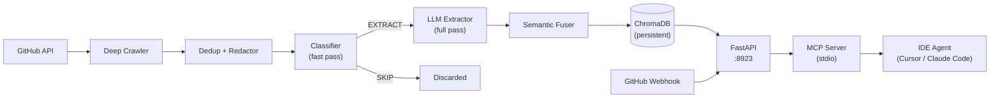
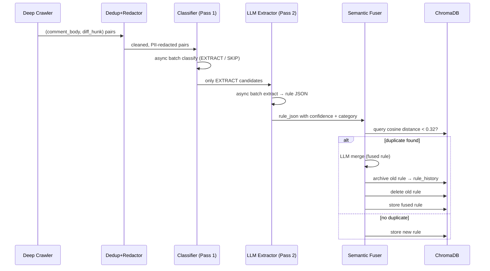
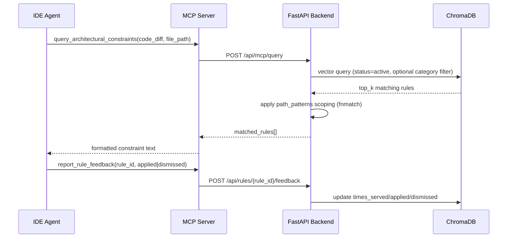

# Architecture

PR-Analysis (PR-Distiller) extracts reusable coding rules from GitHub pull request review
comments and serves them to IDE agents via the Model Context Protocol (MCP). This document
describes the system design, data flows, and key decisions.

---

## System Overview



---

## Services

| Service     | Runtime          | Port / Transport | Role                                               |
|-------------|------------------|------------------|----------------------------------------------------|
| Backend     | Python / FastAPI | 8923 (HTTP)      | Pipeline orchestration, rule storage, REST API     |
| Web UI      | Next.js          | 4096 (HTTP)      | Dashboard: review, approve, block, export rules    |
| MCP Server  | TypeScript       | stdio            | Bridge between IDE agent and backend API           |
| Ollama      | Docker           | 11434 (HTTP)     | Local LLM inference (default provider)             |
| ChromaDB    | Embedded Python  | n/a              | Persistent vector store for rules                  |

### Backend (FastAPI, port 8923)

Runs `api.py` with `uvicorn`. Manages three long-lived objects: `LightRAGManager` (ChromaDB
wrapper), `ConfigManager` (encrypted config persistence), and `JobOrchestrator` (async pipeline
runner). CORS origins are controlled by the `CORS_ORIGINS` env var.

### Web UI (Next.js, port 4096)

Communicates with the backend exclusively through the REST API. Does not touch ChromaDB or the
LLM directly. Displays the rule list, effectiveness stats, job progress, and the settings panel.

### MCP Server (TypeScript, stdio)

Implements the Model Context Protocol over stdin/stdout. Exposes two tools:
`query_architectural_constraints` and `report_rule_feedback`. Forwards calls to the backend
at `PR_DISTILLER_API_URL` (default `http://127.0.0.1:8923`).

### Ollama (local LLM, port 11434)

Default LLM inference backend. The backend and MCP server point at it via `LLM_API_BASE`.
Can be replaced by vLLM, OpenAI, Anthropic, or any OpenAI-compatible endpoint.

### ChromaDB (embedded, persistent)

Stored at `backend/data/code_rag_vectors/`. Two collections:
- `enterprise_rejections` — active/review/blocked rules, cosine-distance indexed.
- `rule_history` — archived superseded rules for merge lineage.

---

## Data Flow

### Extraction Pipeline



### Query Flow (MCP → IDE)



---

## Directory Structure

```
PR-Analysis/
├── backend/
│   ├── api.py                    # FastAPI application and all route handlers
│   ├── settings.py               # Env-var configuration (single source of truth)
│   ├── db/
│   │   └── lightrag_manager.py   # ChromaDB wrapper: store, query, archive, feedback
│   ├── llm/
│   │   ├── extractor.py          # Two-pass classifier + extractor (LargeLLMExtractor)
│   │   └── schema.py             # Pydantic schemas for rule JSON
│   ├── pipeline/
│   │   ├── config_manager.py     # Encrypted config persistence (config.json)
│   │   ├── job_orchestrator.py   # Async pipeline runner with cancel support
│   │   ├── semantic_fuser.py     # Cosine-distance dedup + LLM merge
│   │   ├── deduplication.py      # Hash-based exact dedup filter
│   │   ├── security_redactor.py  # PII/secret redaction before LLM calls
│   │   ├── github_client.py      # GitHub API auth wrapper
│   │   ├── skill_synthesizer.py  # Export rules as agent prompts
│   │   ├── ast_slicer.py         # Code diff AST extraction
│   │   └── dev_cache.py          # Local crawl result cache for dev replay
│   ├── scripts/
│   │   ├── deep_crawler.py       # GitHub PR comment + review + issue crawler
│   │   └── populator.py          # Bulk seeding utility
│   └── data/
│       ├── config.json           # Encrypted persistent config
│       ├── .secret_key           # Fernet key (auto-generated, not committed)
│       └── code_rag_vectors/     # ChromaDB on-disk storage
├── mcp-server/
│   └── src/index.ts              # MCP server: query_architectural_constraints + feedback
├── web-ui/                       # Next.js dashboard
├── docker-compose.yml            # Service definitions
├── docker-compose.override.yml   # Local dev overrides (GPU, mounts)
└── Makefile                      # Convenience targets
```

---

## Key Design Decisions

### Two-Pass Extraction

Every crawled comment passes through a fast binary classifier first (Pass 1) that sends a
single word — `EXTRACT` or `SKIP` — using `max_tokens=10` and `temperature=0.0`. Only comments
classified as `EXTRACT` advance to the full structured extraction (Pass 2). Both passes run as
concurrent async tasks via `asyncio.gather`. This reduces LLM token spend by filtering noise
(translation corrections, typos, one-off config changes) before the expensive structured call.

### Semantic Deduplication

After extraction, `SemanticFuser` queries ChromaDB for the nearest existing rule within the
same repository. If the cosine distance is below `DEDUP_DISTANCE_THRESHOLD` (default `0.32`),
the two rules are semantically equivalent. An LLM call merges them into a single unified rule,
the old rule is archived to `rule_history`, and the fused rule replaces it. This prevents the
rule store from accumulating redundant variations of the same constraint.

### Rule Lifecycle: needs_review → active

Newly extracted rules with confidence ≤ 0.80 enter `needs_review`. They become `active` through
one of two paths: manual approval in the dashboard, or automatic promotion when the rule has
been served to an IDE agent ≥ 5 times with a > 70% acceptance rate. Rules can also be `blocked`,
which prevents semantically similar future extractions from being stored.

### File-Path Scoping

Rules carry a `path_patterns` field (comma-separated fnmatch glob strings, e.g.
`**/auth/*.py,**/security/*.py`). When the MCP server passes a `file_path`, the backend
post-filters query results so only rules whose patterns match the current file are returned.
Rules with no `path_patterns` are unscoped and always match.

### Incremental Crawling with Cursors

Each repository tracks a `last_comment_id` cursor stored in `config.json`. On re-runs the
crawler fetches comments in ascending order and skips IDs already seen, so repeated pipeline
runs only process new activity rather than reprocessing the entire repository history.
