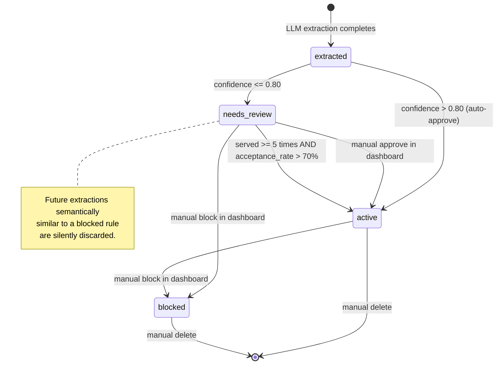

# PR Rules Lifecycle

---

## What Are Rules?

Rules are reusable coding constraints extracted from pull request review comments. When a
reviewer writes "don't use raw SQL here — use the ORM to prevent injection" or "this will cause
an N+1 query in production", they are implicitly stating a constraint that should apply to all
future code in that repository. PR-Distiller captures these constraints automatically and makes
them queryable by IDE agents so they can be enforced before a PR is even opened.

Rules are scoped to a repository, optionally restricted to specific file paths, and carry a
confidence score and category that determine how they are surfaced.

---

## Rule Structure

Each rule is stored as a document in ChromaDB with associated metadata. The logical schema is:

```json
{
  "rule_id": "a1b2c3d4",
  "content": {
    "title": "Validate JWT expiry before trusting claims",
    "description": "JWTs can be structurally valid but expired. Skipping expiry validation allows replay attacks with old tokens.",
    "enforcement_prompt": "Always check the 'exp' claim explicitly after decoding. Do not rely solely on the library's default behavior.",
    "code_examples": {
      "bad_code": "payload = jwt.decode(token, key, algorithms=['HS256'], options={'verify_exp': False})",
      "good_code": "payload = jwt.decode(token, key, algorithms=['HS256'])  # exp verified by default"
    }
  },
  "metadata": {
    "status": "active",
    "confidence": 0.94,
    "category": "security",
    "repo": "acme/backend",
    "occurrence_count": 7,
    "merge_count": 2,
    "merged_from": "old-id-1,old-id-2",
    "times_served": 12,
    "times_applied": 9,
    "times_dismissed": 3
  },
  "scoping": {
    "path_patterns": ["**/auth/*.py", "**/middleware/*.py"]
  }
}
```

### Field Reference

| Field                        | Type    | Description                                                                 |
|------------------------------|---------|-----------------------------------------------------------------------------|
| `rule_id`                    | string  | Short hex ID (8 chars). Unique within ChromaDB.                            |
| `content.title`              | string  | Short imperative phrase describing the constraint.                          |
| `content.description`        | string  | When and why this rule matters; context for the developer.                 |
| `content.enforcement_prompt` | string  | Instruction for an AI code assistant on what to check or avoid.            |
| `content.code_examples`      | object  | Concrete bad/good code snippets illustrating the rule (optional).          |
| `metadata.status`            | string  | One of: `needs_review`, `active`, `blocked`.                               |
| `metadata.confidence`        | float   | LLM confidence score `0.0`–`1.0` from extraction.                         |
| `metadata.category`          | string  | Functional category (see Categories section below).                        |
| `metadata.repo`              | string  | Repository the rule was extracted from (`owner/repo`).                     |
| `metadata.occurrence_count`  | integer | Number of times this pattern has been observed (accumulates on merge).     |
| `metadata.merge_count`       | integer | How many prior rules were merged into this one.                            |
| `metadata.times_served`      | integer | Times this rule has been returned to an IDE agent.                         |
| `metadata.times_applied`     | integer | Times a developer confirmed applying this rule.                            |
| `metadata.times_dismissed`   | integer | Times a developer dismissed this rule.                                     |
| `scoping.path_patterns`      | array   | fnmatch glob strings restricting the rule to specific file paths.          |

---

## Rule Lifecycle



### Transition Details

**`extracted → needs_review`**: Default path for rules where the LLM assigned a confidence
score of 0.80 or below. The rule is stored in ChromaDB but not returned by MCP queries until
promoted.

**`extracted → active`**: Automatic path for high-confidence rules (confidence > `AUTO_APPROVE_CONFIDENCE`,
default 0.80). The rule is immediately returned to IDE agents.

**`needs_review → active` (manual)**: A reviewer approves the rule via the web dashboard or
`POST /api/rules/{rule_id}/approve`. Takes effect immediately.

**`needs_review → active` (automatic)**: After a rule in `needs_review` has been served to an
IDE agent at least 5 times and its acceptance rate exceeds 70%, it is automatically promoted
to `active` on the next feedback call.

**`→ blocked`**: Blocked rules are excluded from all queries and exports. Additionally, when
the Semantic Fuser encounters a new extraction that is semantically similar to a blocked rule
(cosine distance < 0.20), it discards the new extraction without storing it. This prevents the
same rejected pattern from re-entering the store.

---

## Categories

Every rule is assigned exactly one category by the LLM during extraction. Categories are used
to filter MCP queries and to organize the dashboard.

| Category       | Description                                                                         |
|----------------|-------------------------------------------------------------------------------------|
| `security`     | Authentication, authorization, injection, cryptography, secrets management.         |
| `performance`  | N+1 queries, unnecessary computation, memory allocation, caching gaps.             |
| `testing`      | Missing test coverage, untestable code patterns, flaky test practices.             |
| `code-style`   | Naming conventions, formatting patterns, idiomatic usage for the project's language.|
| `architecture` | Module boundaries, dependency direction, abstraction layers, coupling concerns.     |
| `correctness`  | Logic errors, null/edge-case handling, type safety, race conditions, data integrity.|

---

## Confidence Scoring

The LLM extractor assigns a `confidence` float (`0.0`–`1.0`) to each extracted rule based on
how clearly the review comment states a generalizable coding constraint:

- **0.9–1.0**: The comment explicitly and unambiguously states a rule (e.g., "never call X
  directly, always use Y because of Z").
- **0.7–0.9**: The comment clearly implies a rule, though some interpretation was needed.
- **0.5–0.7**: The rule is plausible but the comment was ambiguous or context-dependent.
- **Below 0.5**: The extractor was uncertain; the rule is stored for review but may be noise.

Rules above `AUTO_APPROVE_CONFIDENCE` (default `0.80`) are auto-promoted to `active`. Rules at
or below enter `needs_review`. The threshold is tunable via environment variable — see
[configuration.md](./configuration.md).

---

## Semantic Deduplication

As rules accumulate from multiple PRs and repositories, different comments often describe the
same underlying constraint in different words. The Semantic Fuser prevents redundant rules
from inflating the store.

**Process:**

1. After extraction, the new rule's document text is embedded and queried against ChromaDB
   for the nearest existing rule in the same repository.
2. If the cosine distance is below `DEDUP_DISTANCE_THRESHOLD` (default `0.32`), the two rules
   are considered semantically equivalent.
3. An LLM call is made with both rules as input. The LLM produces a single merged rule that
   preserves all unique technical nuances from both.
4. The old rule is copied to the `rule_history` collection (for lineage tracking) and deleted
   from the main collection.
5. The fused rule is stored with an incremented `occurrence_count` (sum of both rules) and
   a `merged_from` field recording both source IDs.

The `occurrence_count` field therefore represents the total number of times this pattern has
been observed across all merged predecessors — not just the surviving document.

---

## Effectiveness Tracking

Every time the MCP server returns a rule to an IDE agent, the `report_rule_feedback` tool
should be called with the result: `applied` if the developer followed the rule, `dismissed`
if they overrode or ignored it.

These signals feed back into the backend via `POST /api/rules/{rule_id}/feedback`, which
increments `times_served`, `times_applied`, or `times_dismissed` in ChromaDB metadata.

**Automatic promotion logic:** After each feedback call, if the rule is in `needs_review` and
`times_served >= 5` and `times_applied / times_served > 0.70`, the rule is automatically
promoted to `active`.

**Dashboard aggregate stats** are available at `GET /api/stats/effectiveness` and show
per-rule and overall acceptance rates across the collection.

---

## File-Path Scoping

Rules can be restricted to specific files using glob patterns stored in `path_patterns`.
When the MCP server passes a `file_path` with a query, the backend post-filters results so
only rules whose patterns match the current file are returned.

**Pattern syntax:** Standard `fnmatch` glob patterns (Python `fnmatch.fnmatch`).

| Pattern              | Matches                                           |
|----------------------|---------------------------------------------------|
| `**/auth/*.py`       | Any `.py` file in any `auth/` directory           |
| `src/api/*.ts`       | TypeScript files directly under `src/api/`        |
| `*.sql`              | Any `.sql` file at any path                       |
| *(empty)*            | Unscoped — matches every file (default behavior)  |

Multiple patterns are stored as a comma-separated string and evaluated as a logical OR — a
file matches the rule if it satisfies any one of the patterns.

Scoping is set by the LLM during extraction based on the file paths visible in the diff hunk.
It can also be edited manually via the dashboard.
